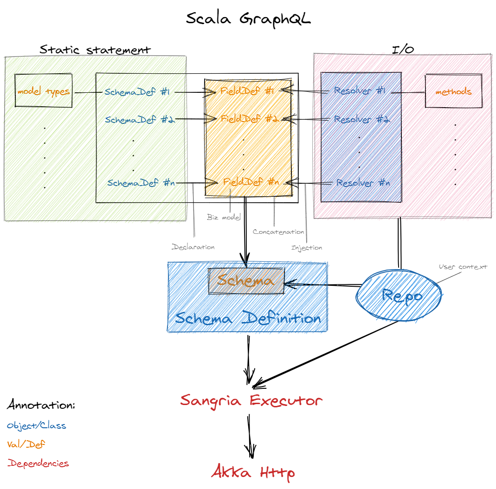

# Scala GraphQL

- Stack: Sangria + Slick + Akka Http

- Purpose: dynamic column query by request fields.

- Run server: `sbt run`

## Structure



1. [`package.scala`](./src/main/scala/com/github/jacobbishopxy/scalaGraphql/package.scala): core functionality

    - `Copyable`: copy a class and update by scala `Map`
    
    - `SlickDynamic`: dynamically construct table columns
    
    - `DynHelper`: call `constructQueryFn` 

2. [`Service.scala`](./src/main/scala/com/github/jacobbishopxy/scalaGraphql/Service.scala)

    App service

3. `prices`: business code

    - `Init.scala`: demo data
    
    - `Model.scala`: data model
    
        - Model object: case class
        
        - Model trait: tableQuery definition
    
    - `Resolver.scala`: data handler
    
    - `SchemaDef.scala`: sangria schema

4. [`Repositories.scala`](./src/main/scala/com/github/jacobbishopxy/scalaGraphql/Repositories.scala)

    Resolvers

5. [`Schemas.scala`](./src/main/scala/com/github/jacobbishopxy/scalaGraphql/Schemas.scala)

    Schemas
    
6. `Server.scala`

    Main


## Test

1. `test/DevSlickDynamicColsQuery.scala`

    test case


## Try

Copy following query string to [localhost](http://localhost:8088/graphql)

```
query {
  getStockPricesEOD(
    tickers: ["000001"] 
    start: "20190102" 
    end: "20190105"
  ) {
    date
    ticker
    open
    close
  }
}
```

Then you will see message as below in the terminal console.

```
que.statements: select "trade_date", "stock_code", "topen", "tclose" from "DEMO" where (("stock_code" in ('000001')) and (ifnull("is_valid",0) = 1)) and (("trade_date" >= '20190101') and ("trade_date" <= '20190105'))
StockPricesEOD(20190101,000001,None,None,None,None,None,None,None,None,None,None,Some(10.0),None,None,Some(13.0),None,None,None,None,None)
StockPricesEOD(20190102,000001,None,None,None,None,None,None,None,None,None,None,Some(10.0),None,None,Some(13.0),None,None,None,None,None)
StockPricesEOD(20190103,000001,None,None,None,None,None,None,None,None,None,None,Some(10.0),None,None,Some(13.0),None,None,None,None,None)
StockPricesEOD(20190104,000001,None,None,None,None,None,None,None,None,None,None,Some(10.0),None,None,Some(13.0),None,None,None,None,None)
StockPricesEOD(20190105,000001,None,None,None,None,None,None,None,None,None,None,Some(10.0),None,None,Some(13.0),None,None,None,None,None)
```

Resulting in [localhost](http://localhost:8088/graphql) as following:

```
{
  "data": {
    "getStockPricesEOD": [
      {
        "date": "20190101",
        "ticker": "000001",
        "open": 10,
        "close": 13
      },
      {
        "date": "20190102",
        "ticker": "000001",
        "open": 10,
        "close": 13
      },
      {
        "date": "20190103",
        "ticker": "000001",
        "open": 10,
        "close": 13
      },
      {
        "date": "20190104",
        "ticker": "000001",
        "open": 10,
        "close": 13
      },
      {
        "date": "20190105",
        "ticker": "000001",
        "open": 10,
        "close": 13
      }
    ]
  }
}
```
